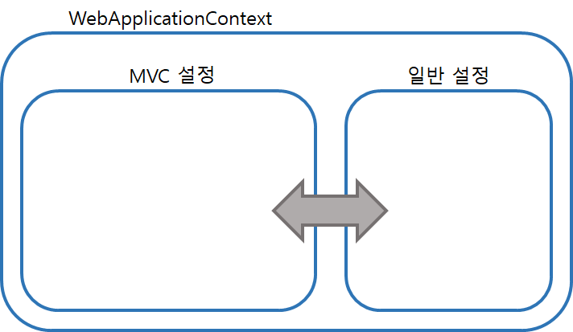
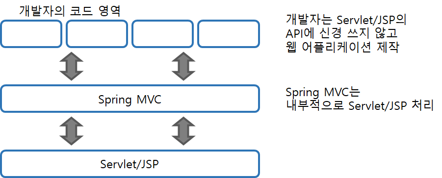

## Part02.05 스프링 MVC 기본 구조

#### 스프링 MVC 프로젝트의 내부 구조

- 스프링 MVC 프로젝트를 구성해서 사용한다는 것

  - 일반 자바 영역(POJO, Plain Oid Java Object: root-context.xml)과 

    Web 관련 영역(servlet-context.xml)을 같이 연동해서 구동하는 것

#

#### 예제 프로젝트 로딩 구조

- web.xml: 서버 구동과 관련된 설정
- root-context.xml, servlet-context.xml: 스프링 관련 설정
  - servlet-context.xml: 내부적으로 웹 관련 처리의 준비작업을 진행

- root-context.xml에 정의된 객체들은 스프링 영역(context) 안에 생성되며 객체들 간의 의존성 처리됨 
- 이후, 스프링 MVC에서 사용하는 DispatcherServlet과 관련된 설정 동작함
  - DispatcherServlet에서 XmlWebApplicationContext를 이용하여 servlet-context.xml 로딩 및 해석
  - 해당 과정에서 생성된 객체들은 root-context.xml에서 생성된 객체들과 연동

#

#### 스프링 MVC의 기본 사상

- 스프링 MVC는 모델 2라는 방식을 개발자들에게 보여주지 않고

  개발자들은 자신에게 필요한 부분만을 집중해서 개발할 수 있는 구조

- Servlet/JSP에서는 request/response 타입의 객체 대신

  HttpServletRequest/HttpServletResponse 타입의 객체를 이용하여

  브라우저에 전송한 정보를 처리

  

- Sping MVC는 개발자의 코드와 Servlet/JSP의 중간 역할이기에

  위 타입의 객체와 같은 Servlet/JSP의 API를 사용하지 않아도 원하는 기능 구현 가능

- 개발자 코드는 Spring MVC에서 동작하기에 어노테이션 방식이나 xml 설정으로 개발 가능함

#

#### 모델2와 스프링 MVC

- 

#

## Part02.06 스프링 MVC의 Controller

#### `@Controller`, `@RequestMapping`

#

#### `@RequestMapping`의 변화

#

#### Controller의 파라미터 수집

#

#### Model이라는 데이터 전달자

#

#### Controller의 리턴 타입

#

#### Controller의 Exception 처리

